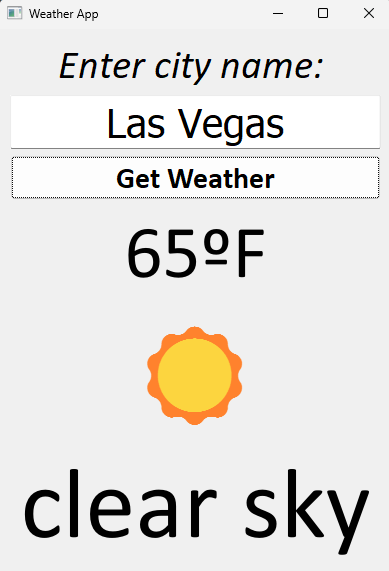

# Weather App 🌦️

A simple weather application built using Python and PyQt5 that retrieves and displays weather information based on a given city name. The app uses the OpenWeather API to fetch real-time weather data and displays it in an intuitive graphical interface, complete with weather descriptions and emojis representing current conditions.

## Features

- Get weather data by city name 🌍
- Display temperature in Fahrenheit and a description of weather conditions
- Icons/emojis for visual representation of the weather
- Error handling for network and API-related issues

## Preview

 

## Prerequisites

- Python 3.x
- PyQt5
- Requests library for handling HTTP requests

To install PyQt5 and requests, you can run:

```bash
    pip install PyQt5 requests
```

## Installation and Usage

1. Clone the repository:

    ```bash
    git clone https://github.com/username/weather-app.git
    cd weather-app
    ```
    
    
2. Add your OpenWeather API Key:

    Replace api_key = "your_api_key_here" in get_weather method with your actual API key. Sign up at OpenWeather to get one.

3. Run the application:
    
    ```bash
    python weather_app.py
    ```

4. Type a city name in the input field and click "Get Weather" to see current weather data.

## Error Handling

This application includes error handling for common issues, including:

    - Incorrect city names
    - Network connection issues
    - API request issues with descriptive feedback for users

## Academic Use

This project was developed for academic purposes as a learning exercise in Python, PyQt5, and API interaction. Feel free to use or modify the code for similar purposes, but please give credit where appropriate.

## Future Features
    - Temperature display in Celsius and Kelvin
    - Multi-day weather forecast
    - Auto-location detection for city name

# Credits
    - Inspired by OpenWeather API documentation and Python GUI tutorials.
## Contributing

If you'd like to contribute to this project, feel free to submit a pull request. For major changes, please open an issue to discuss what you would like to change.

## Disclaimer

This project is for educational use only. The API key included should be replaced with your own for personal testing.
